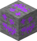
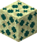
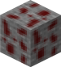
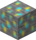
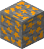

*Wiki page for custom items!*

## ORES

### Dredomite Gem

*Ore can generate in Overworld dimension. Maximum of  6 veins per chunk, 8 ores per vein. Can spawn only in Badlands biome between level 0 and 20.*

### Endotite Gem

*Ore*

### Komodat Gem

*Ore*

### Landium Gem

*Ore*

### Liodite Gem

*Ore*
